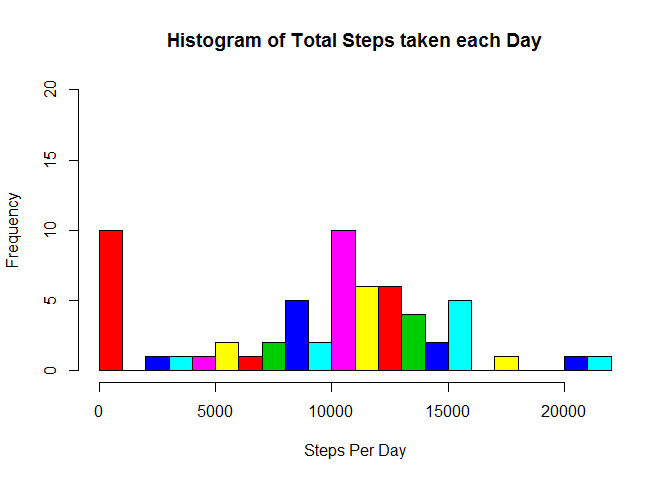
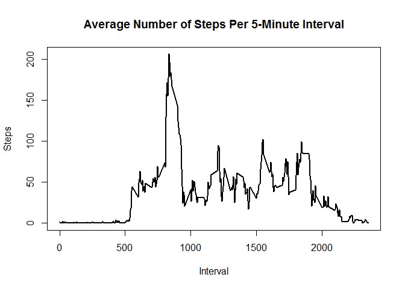
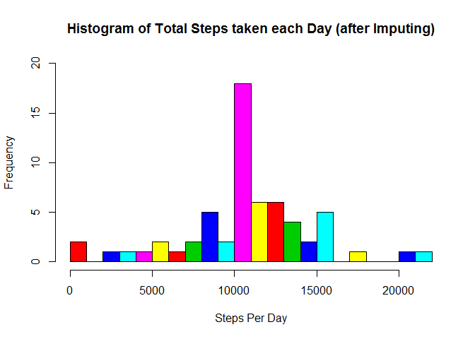
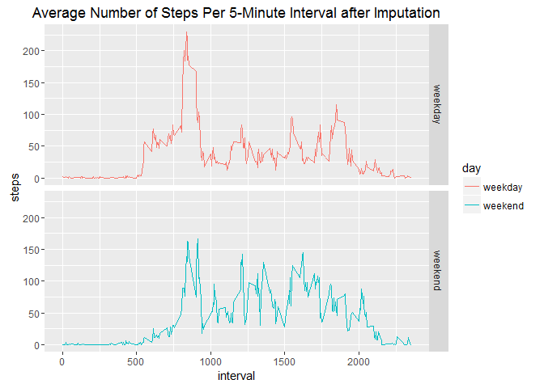

# Reproducible Research: Peer Assessment 1

# Reproducible Research: Week-2: Project 1
## Activity Monitoring (Steps) Data


```r
library(ggplot2)
```

### Loading and preprocessing the data


```r
#### Downloading the Data File
f <- "activity.zip"

f1 <- "activity.csv"
if(!file.exists(f1)) {
    unzip(f)
}
#### Read the Data File 
if(!exists("activity")){
    activity <- read.csv2(file = f1, header = T, sep = ",")
}
```


### What is mean total number of steps taken per day?


```r
stepsperday <- aggregate(activity$steps, list(activity$date), FUN=sum, na.rm = T)
names(stepsperday) <- c(names(activity)[2], names(activity)[1])
```

#### Histogram of the total number of steps taken each day

```r
hist(stepsperday$steps, breaks = 22, ylim = c(0, 20), xlim = c(0,22000), col = rep(2:7), xlab = "Steps Per Day", main = "Histogram of Total Steps taken each Day")
```

<!-- -->

#### Mean and Median of the total number of steps taken per day

```r
MeanStepsPerDay <- mean(stepsperday$steps)
MedianStepsPerDay <- median(stepsperday$steps)
```
* Mean: 9354.2295082
* Median:  10395


### What is the average daily activity pattern?

#### Time series: For each 5-minute interval calculating the average number of steps taken, averaged across all days

```r
AvgStepsPerInterval <- aggregate(activity$steps, list(activity$interval), FUN=mean, na.rm = T)
names(AvgStepsPerInterval) <- c(names(activity)[3], "AvgSteps")

op <- par(mfrow = c(1,1))
plot(AvgStepsPerInterval$interval, AvgStepsPerInterval$AvgSteps, type = "l", lwd = 2, main = "Average Number of Steps Per 5-Minute Interval", xlab = "Interval", ylab = "Steps")
```

<!-- -->

```r
par(op)
```


#### Finding the 5-minute interval having maximum number of average steps

```r
MaxInterval <- as.integer(AvgStepsPerInterval[which.max(AvgStepsPerInterval$AvgSteps),][1])
MaxInterval <- gsub("([0-9]{1,2})([0-9]{2})", "\\1:\\2", MaxInterval)
MaxSteps <- AvgStepsPerInterval[which.max(AvgStepsPerInterval$AvgSteps),][2]
```

* Most no of Steps are 206.1698113 at Interval: 8:35


### Imputing missing values

#### Total number of missing values in the dataset (i.e. the total number of rows with NAs)

```r
TotalRowsWithNAs <- sum(!complete.cases(activity))
```
* Total number of missing values: 2304

#### filling in missing values by choosing the mean for that 5-minute interval

```r
NACases <- !complete.cases(activity)
AvgSteps <- rep(round(AvgStepsPerInterval$AvgSteps),length(levels(activity$date)))
```

#### Creating a new dataset that is equal to the original dataset but with the missing data filled in

```r
activityNew <- activity
activityNew[NACases,][1] <- AvgSteps[NACases]
```

#### Calculate the total number of steps taken per day

```r
stepsperdayNew <- aggregate(activityNew$steps, list(activityNew$date), FUN=sum)
names(stepsperdayNew) <- c(names(activityNew)[2], names(activityNew)[1])
```

#### histogram of the total number of steps taken each day (after Imputing)

```r
hist(stepsperdayNew$steps, breaks = 22, ylim = c(0, 20), xlim = c(0,22000), col = rep(2:7), xlab = "Steps Per Day", main = "Histogram of Total Steps taken each Day (after Imputing)")
```

<!-- -->

#### mean and median of the total number of steps taken per day

```r
MeanStepsPerDayNew <- mean(stepsperdayNew$steps)
MedianStepsPerDayNew <- median(stepsperdayNew$steps)
```
* Mean (Imputed): 10765.64
* Median (Imputed):  10762


### Are there differences in activity patterns between weekdays and weekends?

#### Create a new factor variable in the dataset with two levels - "weekday" and "weekend"

```r
wkday <- c("Monday", "Tuesday", "Wednesday", "Thursday", "Friday") 
for(i in 1:nrow(activityNew)){
    activityNew$day[i] <- if(weekdays(as.Date(activityNew$date[i])) %in% wkday)
        "weekday" 
    else 
        "weekend"
}
activityNew$day <- as.factor(as.character(activityNew$day))
```

#### Make a panel plot containing a time series plot


```r
AvgStepsPerIntervalNew <- aggregate(activityNew$steps, list(activityNew$interval, activityNew$day), FUN=mean)
names(AvgStepsPerIntervalNew) <- c(names(activityNew)[3], names(activityNew)[4], "AvgSteps")

library(ggplot2)
ggplot(AvgStepsPerIntervalNew, aes(x = interval, y=AvgSteps, color=day)) +
    geom_line() +
    facet_grid(day ~ .) +
    labs(title = "Average Number of Steps Per 5-Minute Interval after Imputation", x = "interval", y = "steps")
```

<!-- -->

